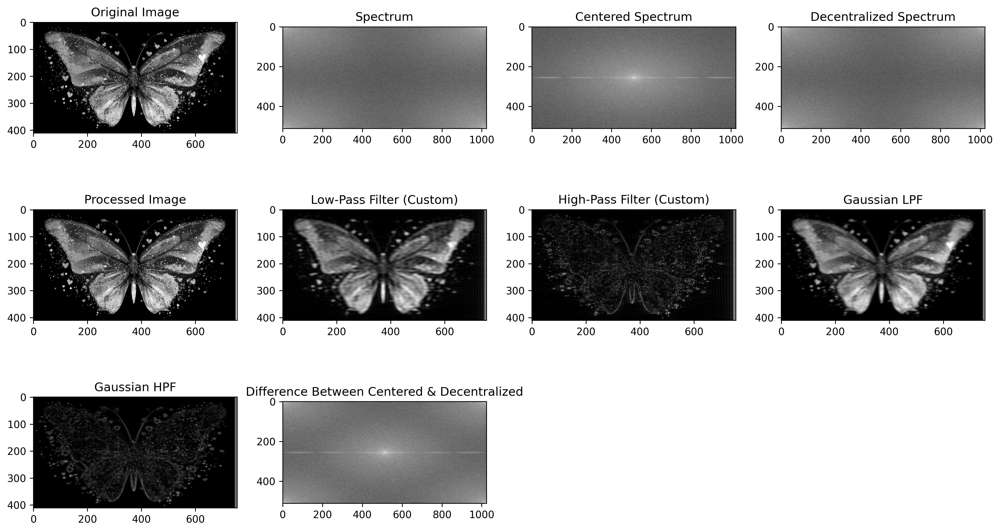
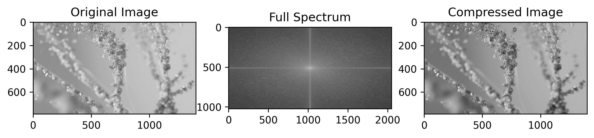
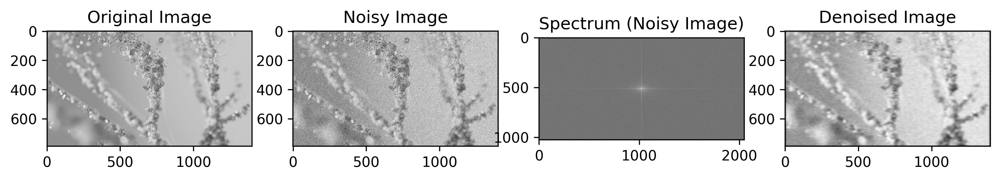

# Fourier Transform in Image Processing 

This project demonstrates how **Fourier Transform (FT)** can be applied to image processing tasks such as:

- ✅ Frequency Analysis
- ✅ Image Compression
- ✅ Noise Removal
- ✅ Low-Pass & High-Pass Filtering
- ✅ Visualization of Frequency Domain
- ✅ Custom vs Predefined FFT Implementations

---

## 📁 Project Structure

<pre>Fourier-Transform-Image-Processing
├── input_images/ 
├── result/ 
├── fft_result/               # Visualizations of FFT and Filtering  
├── ft_compression/           # Compressed image results using FT 
├── ft_noise_removal/         # Noise removal results using LPF in FT 
├── filters.py                # Gaussian, Ideal, Butterworth LPF & HPF 
├── FFFT_and_IFFT_Layer.py    # Custom FFT and IFFT implementations (1D and 2D) 
├── fft_image_processing.py   # Main script to run all transforms and visualize
├── README.md  </pre>


---

## Key Features

### 🔹 Fourier Transform Applications
- **Frequency domain visualization**
- **Custom FFT & IFFT (recursive)** for 1D and 2D signals
- **FFT Shift & Inverse Shift** for frequency centering

### 🔹 Image Compression
- Using low-pass filtering to preserve dominant frequencies and compress image content.

### 🔹 Noise Removal
- Artificial noise added to images.
- **Gaussian LPF** used to remove high-frequency noise.

### 🔹 Visual Comparison
- Custom vs Predefined FFT
- Centered vs Decentralized Spectrum
- Original vs Noisy vs Denoised
- Compression visualized

---

##  Sample Results

| Original | fft_processed_image| Compressed | Denoised |
|----------|------------|----------|------------|
|  | |  |  |

---

##  How to Run

1. Clone the repository:

  ```bash
    git clone https://github.com/yourusername/fourier-transform-image-processing.git
    cd fourier-transform-image-processing
```
2. Install dependencies

```bash
pip install numpy opencv-python matplotlib
```
3. Run the main script:

```bash
python fft_image_processing.py
```
##  Concepts Covered

- Fourier Transform basics  
- Frequency separation in images  
- Signal noise and filtering  
- Spectrum shifting  
- Custom algorithm design (recursive FFT)  
- Visualizing phase and magnitude plots  


##  Acknowledgements

This project was part of a Mathematics + Computer Vision integration to explore frequency domain techniques using both theory and implementation.


## 👤 About Me

**Kashaf Jamil**  
Department of Mathematics  
University of Gujrat  
Roll No: 18541509-085  
**Research Interests:** Image Processing, Computer Vision, Artificial Intelligence  


### Feel free to fork or star the project! Contributions are welcome.
